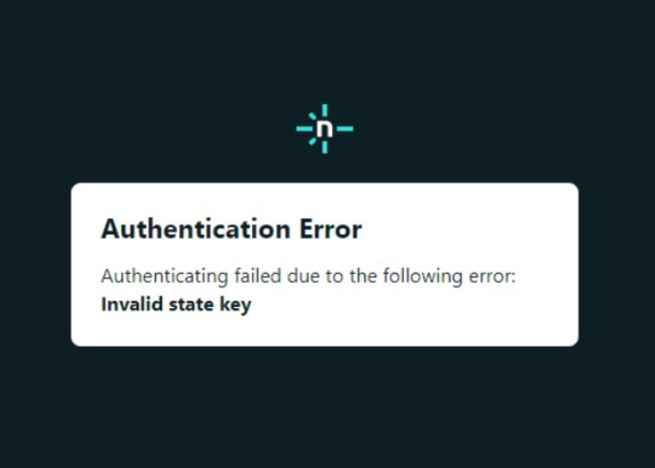
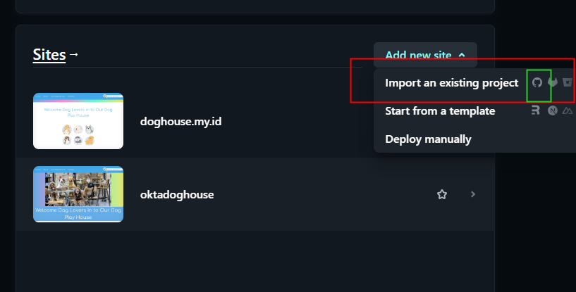
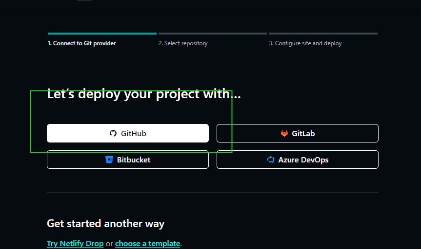
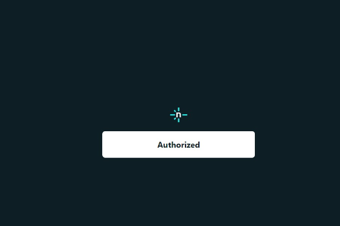
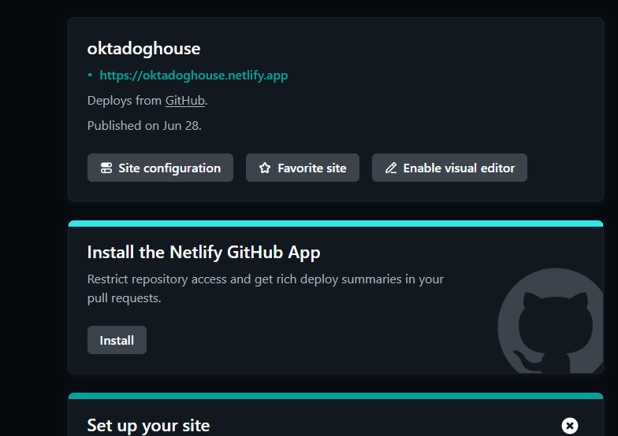
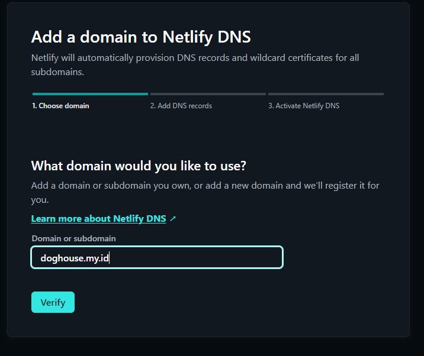
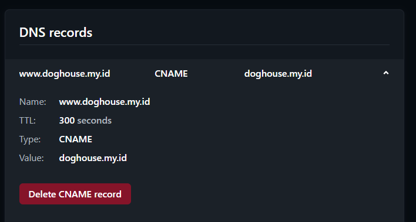
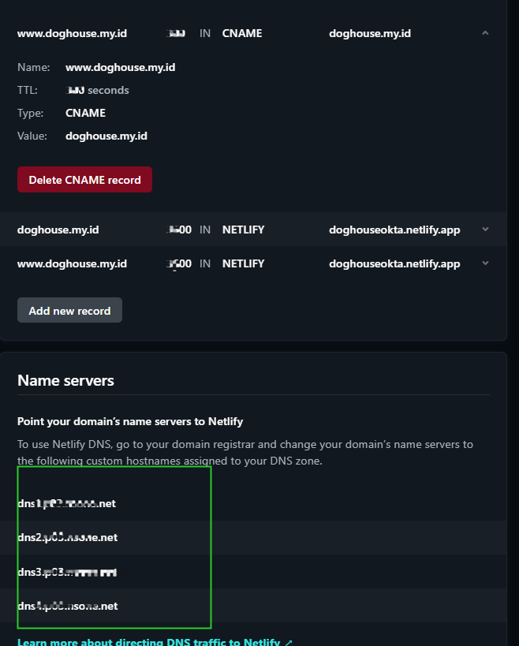
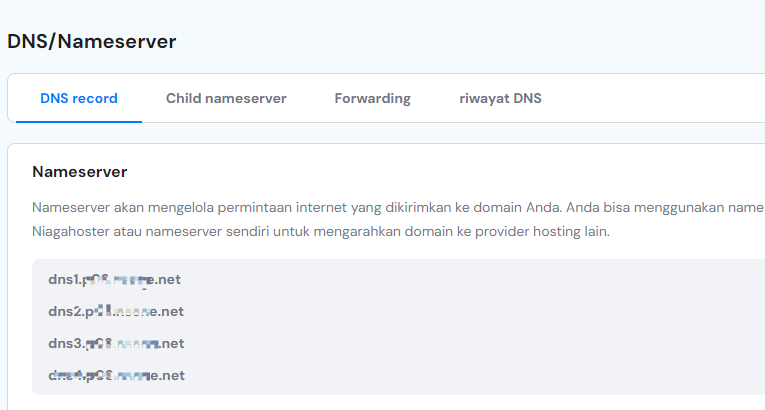
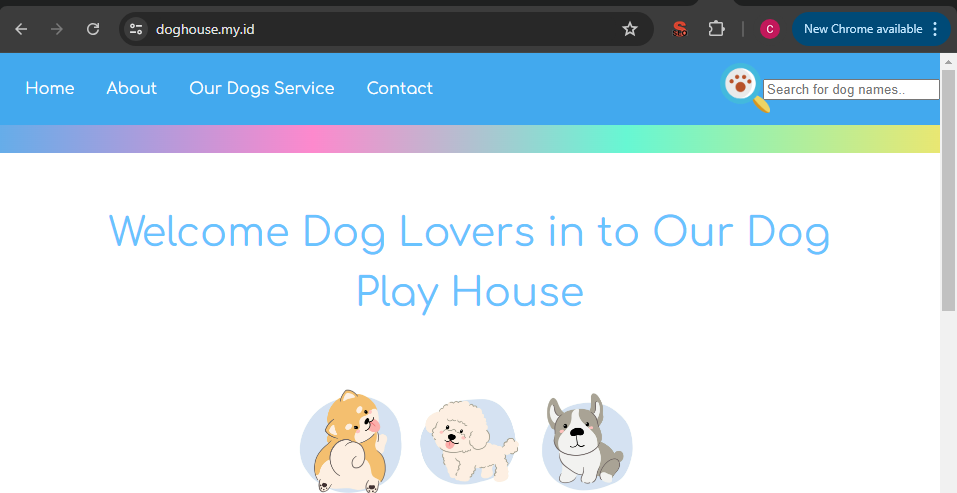

$${\color{Welcome to doghouse.my.id}Light \space Blue}$$
**About**
This website is dedicated to all things related to Dog. Whether you're looking about play house dog house, enjoying all kinds of dog breed in house, buying merchandise, making dog community. Staying connect about healthy life style of the dog.

**Features**
Product Reviews: the product in this website, is about dog services.
Articles and Tips: Articles covering topics such as healthy dog, food, and others activity in doghouse.
Why Dog Houses?
Dog houses are essential for providing shelter and comfort to our beloved pets, especially when they spend time outdoors. Whether it's for protection from the elements or a cozy retreat, a dog house is a valuable addition to any dog owner's life.

**How to Use**
Navigation: Use the menu or search bar to find specific content.
Explore: Browse different categories and tags to discover relevant articles and guides.
Engage: Leave comments, share your own experiences, and connect with other dog owners.
Contributing. 
Booking: submit your schedule with our time
We welcome contributions from the community! If you have expertise in dog houses, dog care, or related fields and would like to contribute an article, guide, or review, please reach out to us through mail@doghouse.my.id

**Support**
For any issues, questions, or feedback, please contact us at mail@doghouse.my.id. We strive to provide the best experience possible for our users and appreciate your input.

**License**
This project is licensed under the teamdogindonesia License - see the LICENSE file for details.

$${\color{**About the owner**}Light \space Blue}$$

Hello My name is **Okta**
This is the assignment for module 2 assignment 2 for 5 july 2024
please support my works

| Platform     | Username          |
| -----------  | -----------       |
| Instagram    | @katuniakz        |
| Email        | <katuniakz@gmail.com>       |

I'm learning about software engineer and I'm trying to learn more about it
I love Cat & Dogs, below some awesome pictures, that you can enjoy

|  |  |
|:------------------------------------------------------------------------------------------------------------------------:|:---------------------------------------------------------------------------------------------------------------------------:|
|                                                  Kocheng Lucu :cat:                                                       |                                                  Doggo Imut :dog:                                                              |

Don't forget to always love animals in your area~~  . :cat: :dog: :cat: :dog:

Yey!!! my site available now! with new link, please checkyour link before connect
go visittt them >>>>>>>> :dog: :dog: https://doghouseokta.netlify.app/

$${\color{i have goodnews, the website available now at www.doghouse.my.id}Light \space Blue}$$

**how to do of my homework**
here

**1. Registering to Netlify**

Visit the Netlify Website: Go to Netlify's official website.

Click on "Sign Up": On the homepage, locate the "Sign Up" button. It's usually at the top right corner of the page.

Sign Up with Email or Git Provider: I choose Github for this time

Email: Enter your email address, create a password, and click "Sign Up".
Git Provider: You can also sign up using your GitHub, GitLab, or Bitbucket account. Click on the respective button (GitHub, GitLab, or Bitbucket) and authorize Netlify to access your account.
Verify Your Email (if applicable): If you signed up using your email address, you may need to verify your email. Netlify will send you a verification link to the email address you provided. Click on the link to verify your account.

Complete the Registration: After verification (if required), you'll be redirected to your Netlify dashboard. Here, you can start exploring the various features Netlify offers, such as deploying new sites, managing domains, setting up continuous deployment, and more.

Explore Netlify Features: Take some time to navigate through your dashboard and explore the settings and options available. Netlify provides powerful features like automatic deployments, form handling, serverless functions, and more, which can enhance your web development and deployment process.

since my register is not smooth as above, i'll explain some of my problem register

**how to handle this?**
i suggest you to contat support to fix the problem and send some of the proving document by email. Netlify team will help you to fix it. Dont worry, we just need to wait at least 24 hours, but sometimes less. so after that try to login again.

Voila!!

Your netlify ready to use, since its connect to my github, we can deploy the with netlify and first step is open the netlify and start to make project or importing it from github
check the picture below

Import from other site

choose from github

the authorized pop up will show, then wait!

after its done, your site has been deploy

easy and cheesyy (enjoy your new website in netlify)

**2. Connect custom domain from netlify using DNS setup**

Now we need some upgrade of the website using custom domain, so i've paid a custom domain with doghouse.my.id after that i need to connect it to my source in netlify

First step. 
open Domain in netlify menu, add new register domain, then input the doghouse.my.id, check picture below

fill your website name

now the domain name its in your netlify, but wait you have to setup the DNS, here how to do it

edit your DNS record in netlify same with DNS in your domain system web

after that Netlify will suggest you to edit your DNS name server

copy the greenbox to the DNS name server in the domain system

Now save, and it will takes time to connect. Just wait patiently, its said 24 hour. But in my case just 1 hours.

Well now you are all can see my full website in www.doghouse.my.id

<a href="https://www.freepik.com/free-vector/colored-purebred-dogs-icon-set_4329617.htm#query=dog&position=4&from_view=keyword&track=sph&uuid=6fc2b26d-7d24-4d41-b5dd-68f511ede4b0">Image by macrovector on Freepik</a>

